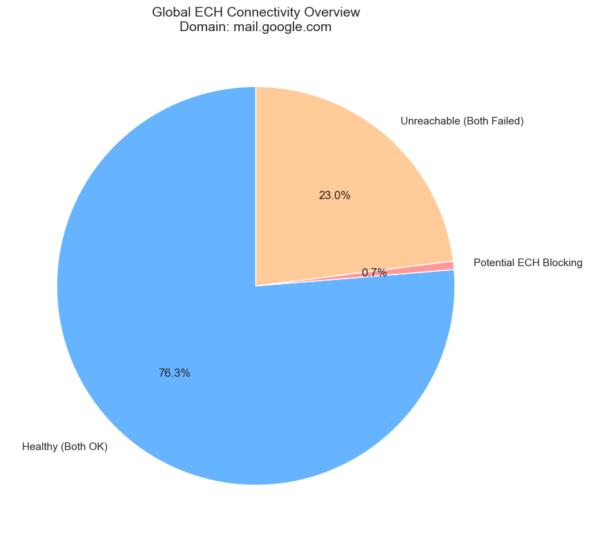
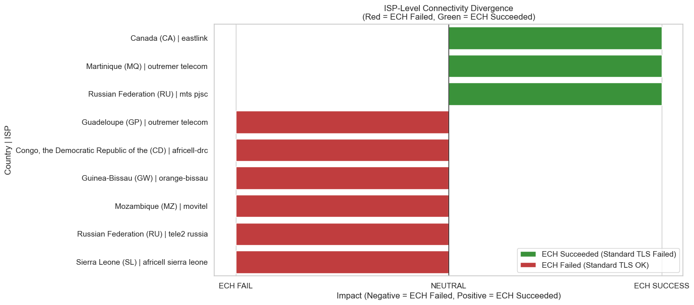
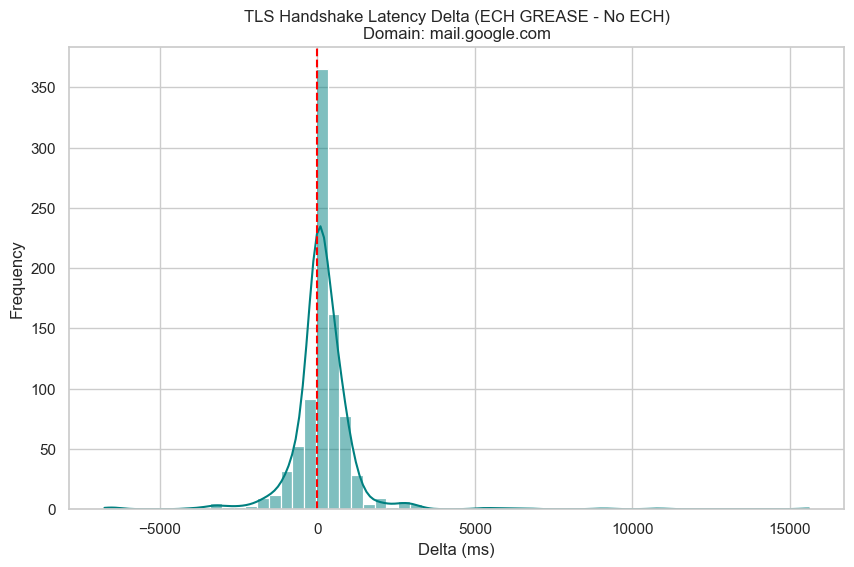

# Raw Report: ECH GREASE Connectivity (From Different Countries)

**Date:** February 04, 2026\
**Target Domain:** `mail.google.com`\
**Analyzed File:** `soax-results-mail_google_com-countries249.csv`

## Executive Summary

This report analyzed **878** valid ISP pairs. ECH GREASE does **not** appear to cause systematic connectivity breakage.

*   **Total ISP Pairs:** 878
*   **Potential Blocking:** 6 (0.68%)
*   **Avg Latency Impact:** 171.97 ms

## 1. Overall Connectivity Results

**Figure 1: Global Connectivity Distribution.** This chart illustrates the health of tested ISP vantage points. "Healthy" represents successful connections with and without ECH. "Potential ECH Blocking" identifies cases where only the standard TLS succeeded. "Unreachable" indicates ISPs that failed both tests, likely due to proxy or local network issues unrelated to ECH.

## 2. Divergent ISP Connectivity (Deep Dive)

**Figure 2: ISP-Level Connectivity Divergence.** This chart highlights ISPs where the connectivity outcome of ECH GREASE differs from standard TLS. **Red bars (Left)** indicate **ECH Failed** (Standard TLS worked, but ECH failed). **Green bars (Right)** indicate **ECH Succeeded** (Standard TLS failed, but ECH succeeded), showing cases where ECH maintained connectivity despite standard TLS issues.

## 3. Performance Impact

**Figure 3: Latency Delta Distribution.** The delta is calculated as `Handshake(GREASE) - Handshake(No ECH)`. Most values clustering around 0ms suggest that ECH GREASE does not introduce significant overhead when connections succeed.

## 4. Deep Dive: Potential Blocking

We detected **6** instances where ECH GREASE failed while the control succeeded. These cases warrant further investigation to distinguish between transient network errors and active blocking.

**Affected Countries:**
*   Congo, the Democratic Republic of the (CD): 1 instance(s)
*   Guadeloupe (GP): 1 instance(s)
*   Guinea-Bissau (GW): 1 instance(s)
*   Mozambique (MZ): 1 instance(s)
*   Russian Federation (RU): 1 instance(s)
*   Sierra Leone (SL): 1 instance(s)

(See Appendix A for the full list of failures)

## 5. Limitations

*   **Transient Errors:** Single-pass testing cannot distinguish between flaky networks and deterministic blocking. Re-runs are required for confirmation.
*   **Proxy Stability:** Residential proxies (SOAX) can be inherently unstable or slow, which may contribute to timeouts independent of ECH.
*   **Sample Size:** The number of ISPs tested per country depends on SOAX's available pool at the time of testing.

## Appendix A: Detailed Failure List

| Country | ISP | No ECH Exit | GREASE Exit | Error Name |
| :--- | :--- | :--- | :--- | :--- |
| Congo, the Democratic Republic of the (CD) | africell-drc | 0 | 35 | CURLE_SSL_CONNECT_ERROR |
| Guadeloupe (GP) | outremer telecom | 0 | 56 | CURLE_RECV_ERROR |
| Guinea-Bissau (GW) | orange-bissau | 0 | 28 | CURLE_OPERATION_TIMEDOUT |
| Mozambique (MZ) | movitel | 0 | 35 | CURLE_SSL_CONNECT_ERROR |
| Russian Federation (RU) | tele2 russia | 0 | 28 | CURLE_OPERATION_TIMEDOUT |
| Sierra Leone (SL) | africell sierra leone | 0 | 56 | CURLE_RECV_ERROR |

## Appendix B: Significant Latency Increases (>500ms)

| Country | ISP | No ECH TLS (ms) | GREASE TLS (ms) | Delta (ms) |
| :--- | :--- | :--- | :--- | :--- |
| Canada (CA) | eastlink | 0 | 15614 | 15614 |
| Iran, Islamic Republic of (IR) | mobile communication company of iran | 3294 | 14113 | 10819 |
| Cuba (CU) | empresa de telecomunicaciones de cuba, s.a. | 2520 | 11596 | 9076 |
| Nigeria (NG) | airtel networks limited | 1043 | 7672 | 6629 |
| Russian Federation (RU) | mts pjsc | 0 | 5966 | 5966 |
| Uzbekistan (UZ) | unitel llc | 2508 | 7997 | 5489 |
| Mali (ML) | sotelmabgp | 3701 | 8879 | 5178 |
| Benin (BJ) | moov benin | 1210 | 4368 | 3158 |
| Sierra Leone (SL) | africell sierra leone | 7140 | 10261 | 3121 |
| South Africa (ZA) | telkom limited | 1264 | 4358 | 3094 |
| Rwanda (RW) | airtel rwanda | 1942 | 4924 | 2982 |
| Iran, Islamic Republic of (IR) | mtn irancell | 2658 | 5584 | 2926 |
| Ghana (GH) | airtel-ghana | 2341 | 5127 | 2786 |
| Mauritius (MU) | mtml | 2418 | 5190 | 2772 |
| Iceland (IS) | nova hf | 1625 | 4330 | 2705 |
| Gabon (GA) | airtel gabon | 3382 | 6070 | 2688 |
| Zimbabwe (ZW) | netone-cellular | 1710 | 4369 | 2659 |
| Togo (TG) | togocom | 7410 | 10062 | 2652 |
| Iraq (IQ) | korek telecom company for communications | 1383 | 3926 | 2543 |
| Fiji (FJ) | digicel fiji | 1587 | 3896 | 2309 |
| Belarus (BY) | unitary enterprise a1 | 1666 | 3802 | 2136 |
| Burundi (BI) | viettel burundi | 2231 | 4290 | 2059 |
| Cambodia (KH) | cellcard | 2396 | 4421 | 2025 |
| Mozambique (MZ) | mcelisp | 3530 | 5545 | 2015 |
| Japan (JP) | japan communication | 14218 | 16117 | 1899 |
| Lithuania (LT) | telia lietuva, ab | 2285 | 4171 | 1886 |
| Japan (JP) | ntt communications corporation | 3323 | 5203 | 1880 |
| Guinea-Bissau (GW) | orange-bissau | 1058 | 2891 | 1833 |
| Solomon Islands (SB) | bemobile solomon islands | 1451 | 3277 | 1826 |
| Mauritius (MU) | mauritius telecom | 1280 | 2815 | 1535 |
| El Salvador (SV) | digicel s.a. de c.v. | 2957 | 4447 | 1490 |
| Namibia (NA) | loc-eight-mobile | 1851 | 3301 | 1450 |
| Argentina (AR) | personal | 904 | 2353 | 1449 |
| Hong Kong (HK) | china mobile hong kong | 2510 | 3936 | 1426 |
| Japan (JP) | ntt docomo | 1692 | 3081 | 1389 |
| Kenya (KE) | jambo-telecoms | 1078 | 2448 | 1370 |
| Iraq (IQ) | seven net | 2104 | 3474 | 1370 |
| Iraq (IQ) | shabaka sfn al-haditha for general trading & infor | 2200 | 3567 | 1367 |
| Madagascar (MG) | telecom-malagasy | 1411 | 2775 | 1364 |
| Sri Lanka (LK) | mobitel | 992 | 2343 | 1351 |
| Pakistan (PK) | special communication organization | 4604 | 5863 | 1259 |
| Tonga (TO) | tonga communications internet network | 1854 | 3098 | 1244 |
| Kazakhstan (KZ) | kcell jsc | 1579 | 2802 | 1223 |
| Madagascar (MG) | gulfsat-madagascar | 1277 | 2495 | 1218 |
| United Arab Emirates (AE) | e& uae | 1141 | 2358 | 1217 |
| Nigeria (NG) | mtn nigeria | 966 | 2164 | 1198 |
| Antigua and Barbuda (AG) | digicel | 1619 | 2802 | 1183 |
| Pakistan (PK) | zong | 1678 | 2847 | 1169 |
| Jordan (JO) | umniah | 1231 | 2397 | 1166 |
| Cameroon (CM) | camtel | 1429 | 2586 | 1157 |
| New Caledonia (NC) | opt-nc | 1380 | 2526 | 1146 |
| Croatia (HR) | hrvatski telekom | 1738 | 2883 | 1145 |
| Cambodia (KH) | smart axiata co.,ltd | 1522 | 2651 | 1129 |
| Bolivia, Plurinational State of (BO) | entel bolivia | 1468 | 2581 | 1113 |
| Congo (CG) | airtel congo | 1421 | 2531 | 1110 |
| Bangladesh (BD) | telenor | 1329 | 2438 | 1109 |
| Mongolia (MN) | mobicom corporation | 1091 | 2196 | 1105 |
| Jamaica (JM) | digicel jamaica | 1675 | 2777 | 1102 |
| Tajikistan (TJ) | cjsc indigo tajikistan | 933 | 2020 | 1087 |
| Maldives (MV) | ooredoo maldives | 1280 | 2357 | 1077 |
| Mexico (MX) | at&t mexico | 3638 | 4711 | 1073 |
| Korea, Republic of (KR) | sk telecom | 1092 | 2158 | 1066 |
| Taiwan, Province of China (TW) | fareastone | 2079 | 3137 | 1058 |
| Russian Federation (RU) | beeline | 991 | 2047 | 1056 |
| Zimbabwe (ZW) | liquid telecommunications | 1028 | 2072 | 1044 |
| Kiribati (KI) | amalgamated telecom holdings kiribati | 1806 | 2831 | 1025 |
| Madagascar (MG) | orange madagascar | 1571 | 2595 | 1024 |
| Japan (JP) | internet initiative japan | 1252 | 2267 | 1015 |
| Bangladesh (BD) | teletalk bangladesh | 1421 | 2425 | 1004 |
| Sudan (SD) | mtn sudan | 1320 | 2315 | 995 |
| Pakistan (PK) | telenor pakistan | 2117 | 3110 | 993 |
| Philippines (PH) | dito telecommunity corp. | 1690 | 2682 | 992 |
| Pakistan (PK) | telenor | 1235 | 2226 | 991 |
| Réunion (RE) | orange | 1534 | 2524 | 990 |
| Malta (MT) | melita | 849 | 1832 | 983 |
| Pakistan (PK) | jazz | 1572 | 2538 | 966 |
| Sao Tome and Principe (ST) | cst-net | 881 | 1816 | 935 |
| Portugal (PT) | lycamobile | 1537 | 2470 | 933 |
| Cambodia (KH) | smart axiata | 2038 | 2967 | 929 |
| Greece (GR) | cosmote mobile telecommunications | 704 | 1629 | 925 |
| United Kingdom (GB) | transatel | 1321 | 2235 | 914 |
| Zambia (ZM) | airtel zambia | 1300 | 2207 | 907 |
| Sri Lanka (LK) | dialog axiata | 1005 | 1912 | 907 |
| Cameroon (CM) | mtn cameroon | 1096 | 2002 | 906 |
| France (FR) | free mobile | 943 | 1848 | 905 |
| Oman (OM) | vodafone oman | 1167 | 2072 | 905 |
| Japan (JP) | softbank corp. | 1475 | 2357 | 882 |
| Bangladesh (BD) | robi | 951 | 1828 | 877 |
| India (IN) | vodafone idea | 1327 | 2196 | 869 |
| Romania (RO) | vodafone romania | 709 | 1573 | 864 |
| Uzbekistan (UZ) | coscom liability company | 932 | 1792 | 860 |
| Thailand (TH) | true mobile | 1093 | 1952 | 859 |
| Myanmar (MM) | mytel | 1057 | 1914 | 857 |
| Bangladesh (BD) | grameenphone | 1009 | 1866 | 857 |
| Somalia (SO) | hormuud | 1197 | 2044 | 847 |
| Chad (TD) | airtel chad | 7755 | 8598 | 843 |
| New Zealand (NZ) | spark new zealand | 1666 | 2506 | 840 |
| Uganda (UG) | mtn uganda | 883 | 1723 | 840 |
| Réunion (RE) | sfr | 1440 | 2273 | 833 |
| Uganda (UG) | airtel uganda | 1237 | 2069 | 832 |
| Malawi (MW) | airtel malawi | 1499 | 2331 | 832 |
| Ireland (IE) | vodafone ireland | 1403 | 2231 | 828 |
| Sierra Leone (SL) | qcell | 1365 | 2190 | 825 |
| Mayotte (YT) | free reunion | 1802 | 2624 | 822 |
| Tanzania, United Republic of (TZ) | ttcldata | 1424 | 2246 | 822 |
| Viet Nam (VN) | mobifone | 1011 | 1827 | 816 |
| Japan (JP) | tokai | 1108 | 1911 | 803 |
| France (FR) | orange | 1036 | 1838 | 802 |
| Lesotho (LS) | econet telecom lesotho | 1251 | 2049 | 798 |
| South Africa (ZA) | vodacom | 1081 | 1878 | 797 |
| France (FR) | lycamobile | 866 | 1645 | 779 |
| Taiwan, Province of China (TW) | asia pacific telecom | 1203 | 1981 | 778 |
| Taiwan, Province of China (TW) | chunghwa telecom | 823 | 1599 | 776 |
| Oman (OM) | ooredoo oman | 1177 | 1947 | 770 |
| Guam (GU) | pti pacifica | 653 | 1417 | 764 |
| Somalia (SO) | somtel | 2153 | 2915 | 762 |
| Portugal (PT) | meo | 1616 | 2378 | 762 |
| South Africa (ZA) | telkom internet | 1264 | 2024 | 760 |
| South Africa (ZA) | mtn business solutions | 3956 | 4712 | 756 |
| Syrian Arab Republic (SY) | syriatel mobile telecom | 797 | 1552 | 755 |
| Taiwan, Province of China (TW) | taiwan mobile | 1004 | 1759 | 755 |
| Taiwan, Province of China (TW) | twn broadband | 842 | 1589 | 747 |
| Philippines (PH) | globe business gfiber broadband plan | 751 | 1497 | 746 |
| Martinique (MQ) | free mobile | 804 | 1541 | 737 |
| Vanuatu (VU) | digicel vanuatu | 1502 | 2238 | 736 |
| Haiti (HT) | natcom s.a | 2284 | 3019 | 735 |
| Kenya (KE) | airtel kenya | 1184 | 1917 | 733 |
| Congo, the Democratic Republic of the (CD) | airtel drc | 2012 | 2742 | 730 |
| Bangladesh (BD) | banglalink | 977 | 1702 | 725 |
| Namibia (NA) | mtc namibia | 4984 | 5704 | 720 |
| Saudi Arabia (SA) | zain saudi arabia | 1100 | 1819 | 719 |
| Niger (NE) | airtel niger | 1079 | 1797 | 718 |
| Virgin Islands, U.S. (VI) | viya | 1047 | 1763 | 716 |
| Kyrgyzstan (KG) | sky mobile | 782 | 1498 | 716 |
| Kazakhstan (KZ) | tns-plus llp | 1026 | 1738 | 712 |
| Gabon (GA) | gabon-telecom | 1253 | 1958 | 705 |
| Ghana (GH) | mtn ghana | 1118 | 1822 | 704 |
| Kenya (KE) | telkom | 1654 | 2351 | 697 |
| Nigeria (NG) | spectranet | 1348 | 2043 | 695 |
| Madagascar (MG) | airtel madagascar | 2794 | 3489 | 695 |
| India (IN) | jio | 1520 | 2209 | 689 |
| United Arab Emirates (AE) | du telecom | 890 | 1579 | 689 |
| Thailand (TH) | ais mobile | 988 | 1671 | 683 |
| Indonesia (ID) | pt telkom indonesia | 928 | 1609 | 681 |
| Zimbabwe (ZW) | telone | 1501 | 2180 | 679 |
| Indonesia (ID) | indosat | 2131 | 2809 | 678 |
| Iraq (IQ) | asiacell communications pjsc | 838 | 1510 | 672 |
| Chile (CL) | movistar chile | 702 | 1371 | 669 |
| Botswana (BW) | botswana telecommunications corporation | 1305 | 1973 | 668 |
| Morocco (MA) | inwi | 3231 | 3899 | 668 |
| Argentina (AR) | claro argentina | 960 | 1628 | 668 |
| Japan (JP) | k-opticom corporation | 1027 | 1694 | 667 |
| Singapore (SG) | simba telecom | 642 | 1308 | 666 |
| Malaysia (MY) | celcomdigi berhad | 860 | 1525 | 665 |
| Guam (GU) | lumen | 948 | 1612 | 664 |
| Uruguay (UY) | antel uruguay | 1420 | 2083 | 663 |
| Réunion (RE) | telco oi | 3278 | 3938 | 660 |
| Philippines (PH) | smart communications | 1046 | 1703 | 657 |
| Israel (IL) | partner communications | 1206 | 1861 | 655 |
| India (IN) | airtel | 979 | 1633 | 654 |
| Iraq (IQ) | telsat broadband ltd | 1007 | 1661 | 654 |
| Russian Federation (RU) | s.u.e. dpr republic operator of networks | 794 | 1445 | 651 |
| Switzerland (CH) | sunrise | 1387 | 2038 | 651 |
| Norway (NO) | telenor norge | 1660 | 2310 | 650 |
| Tajikistan (TJ) | cjsc babilon-mobile | 1096 | 1743 | 647 |
| Spain (ES) | orange espana | 905 | 1551 | 646 |
| Philippines (PH) | globe telecom | 954 | 1591 | 637 |
| Samoa (WS) | vodafone samoa | 1932 | 2568 | 636 |
| Uganda (UG) | tangerine-ug | 1089 | 1725 | 636 |
| Uzbekistan (UZ) | universal mobile systems lcc | 934 | 1562 | 628 |
| Kazakhstan (KZ) | 2day telecom | 1385 | 2011 | 626 |
| Malaysia (MY) | u mobile | 778 | 1402 | 624 |
| South Africa (ZA) | cell c | 1764 | 2382 | 618 |
| Moldova, Republic of (MD) | orange moldova | 577 | 1194 | 617 |
| Pakistan (PK) | pakistan mobile communication limited | 1217 | 1833 | 616 |
| Morocco (MA) | orange morocco | 681 | 1295 | 614 |
| Dominica (DM) | flow | 960 | 1574 | 614 |
| Bahrain (BH) | stc bahrain | 1065 | 1679 | 614 |
| Lao People's Democratic Republic (LA) | lao telecom communication, ltc | 1007 | 1618 | 611 |
| Tanzania, United Republic of (TZ) | vodacom tanzania | 1034 | 1643 | 609 |
| Azerbaijan (AZ) | nar | 636 | 1243 | 607 |
| Kuwait (KW) | stc kuwait | 974 | 1581 | 607 |
| Djibouti (DJ) | djibouti telecom | 1011 | 1614 | 603 |
| Saudi Arabia (SA) | mobily | 713 | 1314 | 601 |
| Russian Federation (RU) | tbank jsc | 820 | 1414 | 594 |
| Dominican Republic (DO) | visnetwork srl | 543 | 1136 | 593 |
| Mongolia (MN) | g-mobile corporation | 882 | 1473 | 591 |
| Burkina Faso (BF) | onatel | 1203 | 1789 | 586 |
| Gambia (GM) | qcell | 740 | 1326 | 586 |
| Belarus (BY) | best cjsc | 936 | 1521 | 585 |
| Estonia (EE) | tele2 estonia | 693 | 1277 | 584 |
| Spain (ES) | telefonica de espana static ip | 640 | 1219 | 579 |
| Poland (PL) | orange polska | 630 | 1208 | 578 |
| Brazil (BR) | claro brazil | 1178 | 1753 | 575 |
| Netherlands (NL) | kpn | 1085 | 1658 | 573 |
| Germany (DE) | lebara | 731 | 1303 | 572 |
| Myanmar (MM) | atom myanmar | 1039 | 1610 | 571 |
| Turkey (TR) | turk telekom | 574 | 1128 | 554 |
| Kyrgyzstan (KG) | nur telecom | 974 | 1522 | 548 |
| Viet Nam (VN) | viettel group | 793 | 1341 | 548 |
| Spain (ES) | yoigo | 535 | 1081 | 546 |
| Netherlands (NL) | lycamobile | 670 | 1215 | 545 |
| Costa Rica (CR) | grupo ice | 754 | 1292 | 538 |
| Spain (ES) | ena operador de telecomunicaciones s.l. | 663 | 1199 | 536 |
| French Guiana (GF) | outremer telecom | 641 | 1177 | 536 |
| Turkey (TR) | vodafone turkey | 565 | 1100 | 535 |
| Pakistan (PK) | ptcl | 1133 | 1664 | 531 |
| Trinidad and Tobago (TT) | digicel trinidad & tobago | 1002 | 1530 | 528 |
| Italy (IT) | tim mobile | 796 | 1318 | 522 |
| Belarus (BY) | mts belarus | 987 | 1509 | 522 |
| Albania (AL) | vodafone albania | 727 | 1246 | 519 |
| Italy (IT) | vodafone italia | 662 | 1181 | 519 |
| United Kingdom (GB) | vodafone | 678 | 1192 | 514 |
| Cameroon (CM) | orange cameroun | 1705 | 2215 | 510 |
| Lithuania (LT) | bite lietuva | 1111 | 1618 | 507 |
| Belarus (BY) | isp garant-catv-gomel | 759 | 1264 | 505 |
| Sweden (SE) | telia mobile | 636 | 1141 | 505 |
| Senegal (SN) | sonatel | 1038 | 1542 | 504 |
| Mali (ML) | orange mali | 822 | 1324 | 502 |

