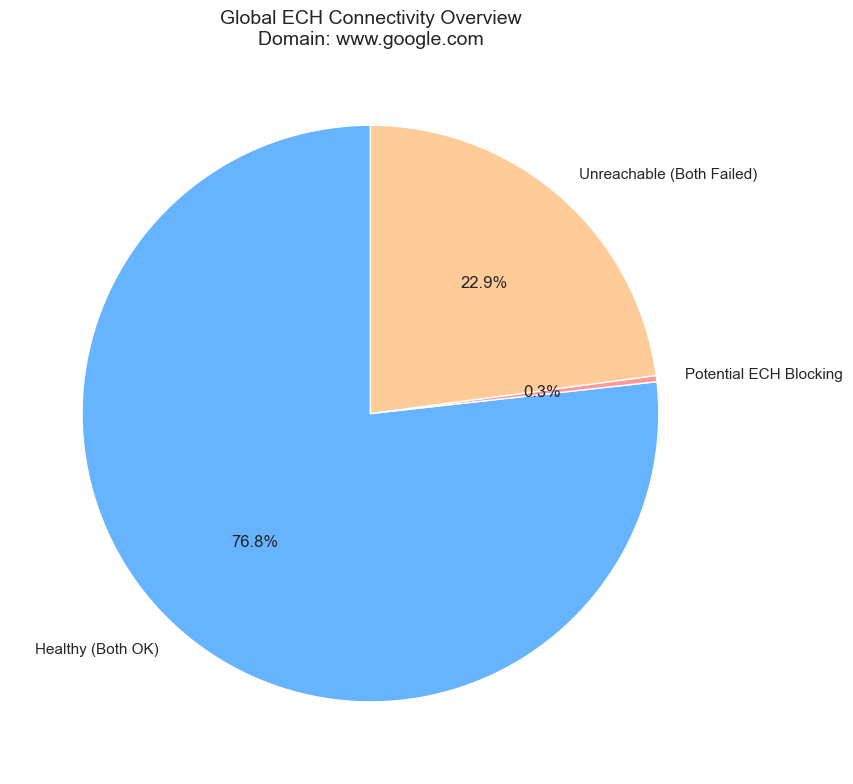
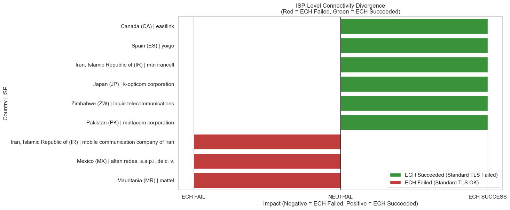
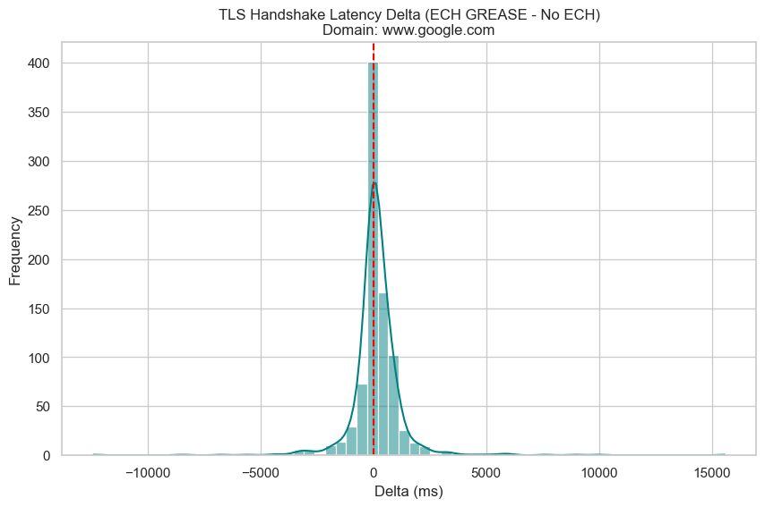

# Raw Report: ECH GREASE Connectivity (From Different Countries)

**Date:** February 04, 2026\
**Target Domain:** `www.google.com`\
**Analyzed File:** `soax-results-www_google_com-countries249.csv`

## Executive Summary

This report analyzed **878** valid ISP pairs. ECH GREASE does **not** appear to cause systematic connectivity breakage.

*   **Total ISP Pairs:** 878
*   **Potential Blocking:** 3 (0.34%)
*   **Avg Latency Impact:** 158.71 ms

## 1. Overall Connectivity Results

**Figure 1: Global Connectivity Distribution.** This chart illustrates the health of tested ISP vantage points. "Healthy" represents successful connections with and without ECH. "Potential ECH Blocking" identifies cases where only the standard TLS succeeded. "Unreachable" indicates ISPs that failed both tests, likely due to proxy or local network issues unrelated to ECH.

## 2. Divergent ISP Connectivity (Deep Dive)

**Figure 2: ISP-Level Connectivity Divergence.** This chart highlights ISPs where the connectivity outcome of ECH GREASE differs from standard TLS. **Red bars (Left)** indicate **ECH Failed** (Standard TLS worked, but ECH failed). **Green bars (Right)** indicate **ECH Succeeded** (Standard TLS failed, but ECH succeeded), showing cases where ECH maintained connectivity despite standard TLS issues.

## 3. Performance Impact

**Figure 3: Latency Delta Distribution.** The delta is calculated as `Handshake(GREASE) - Handshake(No ECH)`. Most values clustering around 0ms suggest that ECH GREASE does not introduce significant overhead when connections succeed.

## 4. Deep Dive: Potential Blocking

We detected **3** instances where ECH GREASE failed while the control succeeded. These cases warrant further investigation to distinguish between transient network errors and active blocking.

**Affected Countries:**
*   Iran, Islamic Republic of (IR): 1 instance(s)
*   Mauritania (MR): 1 instance(s)
*   Mexico (MX): 1 instance(s)

(See Appendix A for the full list of failures)

## 5. Limitations

*   **Transient Errors:** Single-pass testing cannot distinguish between flaky networks and deterministic blocking. Re-runs are required for confirmation.
*   **Proxy Stability:** Residential proxies (SOAX) can be inherently unstable or slow, which may contribute to timeouts independent of ECH.
*   **Sample Size:** The number of ISPs tested per country depends on SOAX's available pool at the time of testing.

## Appendix A: Detailed Failure List

| Country | ISP | No ECH Exit | GREASE Exit | Error Name |
| :--- | :--- | :--- | :--- | :--- |
| Iran, Islamic Republic of (IR) | mobile communication company of iran | 0 | 28 | CURLE_OPERATION_TIMEDOUT |
| Mauritania (MR) | mattel | 0 | 28 | CURLE_OPERATION_TIMEDOUT |
| Mexico (MX) | altan redes, s.a.p.i. de c. v. | 0 | 28 | CURLE_OPERATION_TIMEDOUT |

## Appendix B: Significant Latency Increases (>500ms)

| Country | ISP | No ECH TLS (ms) | GREASE TLS (ms) | Delta (ms) |
| :--- | :--- | :--- | :--- | :--- |
| Canada (CA) | eastlink | 0 | 15569 | 15569 |
| Mali (ML) | mali-atel | 2125 | 12109 | 9984 |
| Togo (TG) | togocom | 3134 | 12048 | 8914 |
| Togo (TG) | atlantique telecom | 7482 | 15101 | 7619 |
| Spain (ES) | yoigo | 0 | 5992 | 5992 |
| Tajikistan (TJ) | zet-mobile | 1703 | 7629 | 5926 |
| Congo (CG) | mtn congo | 2145 | 7850 | 5705 |
| Brazil (BR) | tim live | 3064 | 8115 | 5051 |
| Egypt (EG) | telecom egypt | 1239 | 5627 | 4388 |
| Algeria (DZ) | atm | 600 | 4178 | 3578 |
| Solomon Islands (SB) | bemobile solomon islands | 9456 | 12974 | 3518 |
| Central African Republic (CF) | telecel-centrafrique | 2563 | 5796 | 3233 |
| Dominican Republic (DO) | viva dominicana | 1940 | 5158 | 3218 |
| Morocco (MA) | inwi | 1483 | 4669 | 3186 |
| Ghana (GH) | airtel-ghana | 3415 | 6485 | 3070 |
| Lithuania (LT) | telia lietuva, ab | 1639 | 4449 | 2810 |
| Martinique (MQ) | digicel antilles francaises guyane | 1665 | 4069 | 2404 |
| Mexico (MX) | altan redes, s.a.p.i. de c. v. | 12127 | 14480 | 2353 |
| Austria (AT) | magenta telekom | 1018 | 3359 | 2341 |
| Chile (CL) | entel chile | 2039 | 4344 | 2305 |
| Saudi Arabia (SA) | rcell | 3989 | 6280 | 2291 |
| Hong Kong (HK) | china mobile hong kong | 1722 | 3954 | 2232 |
| Cyprus (CY) | epic | 1190 | 3397 | 2207 |
| Zambia (ZM) | beeline-telecoms-limited | 2334 | 4538 | 2204 |
| Burkina Faso (BF) | orange burkina faso | 2377 | 4458 | 2081 |
| Slovenia (SI) | telekom slovenije | 1267 | 3306 | 2039 |
| Afghanistan (AF) | afghan wireless communication company | 3590 | 5615 | 2025 |
| Madagascar (MG) | orange madagascar | 4342 | 6275 | 1933 |
| Mozambique (MZ) | vodacom mozambique | 4310 | 6242 | 1932 |
| Italy (IT) | digi italy | 1153 | 3083 | 1930 |
| Namibia (NA) | loc-eight-mobile | 1302 | 3206 | 1904 |
| United States (US) | uscellular | 1125 | 2922 | 1797 |
| Rwanda (RW) | airtel rwanda | 934 | 2707 | 1773 |
| Japan (JP) | japan communication | 1598 | 3370 | 1772 |
| Eswatini (SZ) | swazimtn-ltd | 1225 | 2970 | 1745 |
| Panama (PA) | tigo panama | 2107 | 3813 | 1706 |
| Kazakhstan (KZ) | kcell jsc | 1245 | 2934 | 1689 |
| Afghanistan (AF) | afghan wireless | 1766 | 3400 | 1634 |
| Thailand (TH) | true mobile | 1305 | 2895 | 1590 |
| Samoa (WS) | vodafone samoa | 1610 | 3142 | 1532 |
| Brazil (BR) | algar telecom | 1238 | 2742 | 1504 |
| Uganda (UG) | airtel uganda | 1713 | 3162 | 1449 |
| Kyrgyzstan (KG) | sky mobile | 1354 | 2780 | 1426 |
| Congo (CG) | airtel congo | 1608 | 2999 | 1391 |
| Serbia (RS) | telenor d.o.o. | 974 | 2351 | 1377 |
| Czech Republic (CZ) | vodafone czech republic | 2519 | 3835 | 1316 |
| Mozambique (MZ) | movitel | 2081 | 3378 | 1297 |
| Sao Tome and Principe (ST) | cst-net | 1479 | 2775 | 1296 |
| Gambia (GM) | africell | 1099 | 2381 | 1282 |
| Malaysia (MY) | celcomdigi berhad | 1844 | 3124 | 1280 |
| Tonga (TO) | tonga communications internet network | 2108 | 3386 | 1278 |
| Germany (DE) | o2 deutschland | 1633 | 2908 | 1275 |
| Algeria (DZ) | optimum-telecom-algeria | 544 | 1807 | 1263 |
| Mauritius (MU) | mtml | 1137 | 2390 | 1253 |
| Burundi (BI) | ucom-wic | 1344 | 2594 | 1250 |
| Syrian Arab Republic (SY) | syrian telecom | 1187 | 2432 | 1245 |
| Guadeloupe (GP) | outremer telecom | 1757 | 2990 | 1233 |
| Botswana (BW) | botswana telecommunications corporation | 2204 | 3429 | 1225 |
| Mexico (MX) | at&t mexico | 806 | 2001 | 1195 |
| Russian Federation (RU) | s.u.e. dpr republic operator of networks | 806 | 1993 | 1187 |
| Japan (JP) | ntt docomo business | 2217 | 3361 | 1144 |
| South Africa (ZA) | telkom internet | 1377 | 2521 | 1144 |
| Bahrain (BH) | batelco | 830 | 1973 | 1143 |
| Réunion (RE) | orange | 1574 | 2700 | 1126 |
| Mexico (MX) | movistar mexico | 505 | 1627 | 1122 |
| Ghana (GH) | mtn ghana | 1249 | 2364 | 1115 |
| Tajikistan (TJ) | closed joint stock company tt mobile | 1433 | 2538 | 1105 |
| Tanzania, United Republic of (TZ) | vodacom tanzania | 893 | 1979 | 1086 |
| Bangladesh (BD) | teletalk bangladesh | 964 | 2049 | 1085 |
| Kiribati (KI) | amalgamated telecom holdings kiribati | 1692 | 2777 | 1085 |
| Malawi (MW) | airtel malawi | 1475 | 2558 | 1083 |
| Congo, the Democratic Republic of the (CD) | africell-drc | 1193 | 2266 | 1073 |
| Poland (PL) | comasoft | 904 | 1971 | 1067 |
| Liberia (LR) | orange liberia | 1356 | 2423 | 1067 |
| Réunion (RE) | sfr | 1311 | 2372 | 1061 |
| Tonga (TO) | digicel tonga | 1380 | 2407 | 1027 |
| Georgia (GE) | magticom | 977 | 2000 | 1023 |
| Tanzania, United Republic of (TZ) | ttcldata | 1149 | 2171 | 1022 |
| France (FR) | lycamobile | 1233 | 2254 | 1021 |
| Costa Rica (CR) | grupo ice | 746 | 1759 | 1013 |
| Dominican Republic (DO) | claro dominican republic | 711 | 1720 | 1009 |
| Bangladesh (BD) | robi | 992 | 1996 | 1004 |
| Australia (AU) | telstra internet | 2241 | 3238 | 997 |
| Iraq (IQ) | seven net | 867 | 1857 | 990 |
| Kenya (KE) | jambo-telecoms | 1092 | 2063 | 971 |
| Mongolia (MN) | mobicom corporation | 1006 | 1953 | 947 |
| Madagascar (MG) | telecom-malagasy | 1407 | 2351 | 944 |
| Ireland (IE) | eir broadband | 817 | 1759 | 942 |
| Zimbabwe (ZW) | telone | 1274 | 2205 | 931 |
| Zambia (ZM) | airtel zambia | 1463 | 2392 | 929 |
| Nigeria (NG) | spectranet | 2316 | 3226 | 910 |
| Tajikistan (TJ) | cjsc babilon-mobile | 1220 | 2129 | 909 |
| Armenia (AM) | viva armenia cjsc | 1496 | 2403 | 907 |
| Guam (GU) | pti pacifica | 867 | 1773 | 906 |
| Mayotte (YT) | free reunion | 1636 | 2541 | 905 |
| Malaysia (MY) | u mobile | 1035 | 1937 | 902 |
| Tunisia (TN) | ooredoo tunisia | 1412 | 2313 | 901 |
| Sri Lanka (LK) | mobitel | 1021 | 1911 | 890 |
| Vanuatu (VU) | digicel vanuatu | 1506 | 2395 | 889 |
| Oman (OM) | ooredoo oman | 928 | 1805 | 877 |
| Belarus (BY) | best cjsc | 1062 | 1938 | 876 |
| Ethiopia (ET) | safaricom | 1050 | 1923 | 873 |
| Somalia (SO) | telesom | 1340 | 2206 | 866 |
| New Caledonia (NC) | opt-nc | 1455 | 2320 | 865 |
| Kuwait (KW) | stc kuwait | 968 | 1832 | 864 |
| Pakistan (PK) | ptcl | 1178 | 2040 | 862 |
| Mali (ML) | orange mali | 3236 | 4095 | 859 |
| Japan (JP) | softbank corp. | 1227 | 2085 | 858 |
| Madagascar (MG) | gulfsat-madagascar | 1501 | 2356 | 855 |
| Iraq (IQ) | asiacell communications pjsc | 1073 | 1915 | 842 |
| Philippines (PH) | globe telecom | 1021 | 1860 | 839 |
| Malaysia (MY) | celcomdigi | 812 | 1649 | 837 |
| Kazakhstan (KZ) | tns-plus llp | 959 | 1796 | 837 |
| Bhutan (BT) | druknet isp | 1025 | 1862 | 837 |
| Taiwan, Province of China (TW) | asia pacific telecom | 935 | 1768 | 833 |
| Japan (JP) | ntt docomo | 1172 | 1986 | 814 |
| Nigeria (NG) | globacom | 1288 | 2099 | 811 |
| Iraq (IQ) | telsat broadband ltd | 864 | 1672 | 808 |
| Uganda (UG) | mtn uganda | 1213 | 2012 | 799 |
| Indonesia (ID) | xl axiata | 939 | 1737 | 798 |
| Iraq (IQ) | comm1 | 975 | 1761 | 786 |
| Niger (NE) | airtel niger | 1069 | 1842 | 773 |
| Chad (TD) | millicom-chad | 1742 | 2512 | 770 |
| Tanzania, United Republic of (TZ) | mic tanzania | 1326 | 2094 | 768 |
| Thailand (TH) | ais mobile | 914 | 1675 | 761 |
| Uzbekistan (UZ) | coscom liability company | 1295 | 2050 | 755 |
| United Kingdom (GB) | transatel | 915 | 1670 | 755 |
| Philippines (PH) | smart communications | 859 | 1612 | 753 |
| Taiwan, Province of China (TW) | chunghwa telecom | 834 | 1587 | 753 |
| Burkina Faso (BF) | onatel | 1665 | 2418 | 753 |
| Indonesia (ID) | pt telkom indonesia | 1098 | 1850 | 752 |
| Italy (IT) | spusu italy | 1952 | 2702 | 750 |
| South Africa (ZA) | vodacom | 1469 | 2218 | 749 |
| Russian Federation (RU) | tbank jsc | 714 | 1463 | 749 |
| Kenya (KE) | safaricom | 861 | 1605 | 744 |
| Netherlands (NL) | kpn | 1764 | 2503 | 739 |
| South Africa (ZA) | mtn sa mobile | 1164 | 1899 | 735 |
| Tajikistan (TJ) | llc babilon-t | 920 | 1654 | 734 |
| Guam (GU) | lumen | 1257 | 1986 | 729 |
| India (IN) | jio | 973 | 1694 | 721 |
| Argentina (AR) | claro argentina | 1909 | 2627 | 718 |
| Brazil (BR) | tim brasil | 897 | 1612 | 715 |
| Haiti (HT) | alpha communications network | 726 | 1441 | 715 |
| Switzerland (CH) | sunrise | 1962 | 2676 | 714 |
| Ecuador (EC) | conecel | 968 | 1682 | 714 |
| Korea, Republic of (KR) | sk telecom | 1145 | 1853 | 708 |
| Nepal (NP) | nepal telecom | 1090 | 1792 | 702 |
| Lesotho (LS) | econet telecom lesotho | 1146 | 1842 | 696 |
| Slovakia (SK) | orange slovensko | 584 | 1274 | 690 |
| Tajikistan (TJ) | cjsc indigo tajikistan | 917 | 1607 | 690 |
| Côte d'Ivoire (CI) | mtn cote divoire | 3810 | 4499 | 689 |
| Maldives (MV) | ooredoo maldives | 1072 | 1760 | 688 |
| South Africa (ZA) | telkom limited | 1297 | 1983 | 686 |
| Monaco (MC) | monaco telecom | 711 | 1396 | 685 |
| Benin (BJ) | benin telecom | 860 | 1545 | 685 |
| Cameroon (CM) | mtn cameroon | 1013 | 1694 | 681 |
| Thailand (TH) | ais eds | 865 | 1545 | 680 |
| Sudan (SD) | mtn sudan | 1149 | 1823 | 674 |
| Luxembourg (LU) | post luxembourg | 379 | 1051 | 672 |
| Singapore (SG) | singtel mobile | 809 | 1479 | 670 |
| Antigua and Barbuda (AG) | apua | 844 | 1513 | 669 |
| Bangladesh (BD) | banglalink digital communications ltd. | 1069 | 1738 | 669 |
| United Arab Emirates (AE) | du telecom | 1324 | 1991 | 667 |
| Kuwait (KW) | zain kuwait | 713 | 1375 | 662 |
| Cyprus (CY) | kktc telsim | 709 | 1370 | 661 |
| United Kingdom (GB) | vodafone | 614 | 1275 | 661 |
| South Africa (ZA) | rain | 1024 | 1676 | 652 |
| Bahrain (BH) | zain bahrain b.s.c. | 1088 | 1739 | 651 |
| Papua New Guinea (PG) | vodafone png | 5108 | 5756 | 648 |
| Senegal (SN) | sudatel-senegal | 735 | 1378 | 643 |
| United Arab Emirates (AE) | du | 1269 | 1911 | 642 |
| Taiwan, Province of China (TW) | fareastone | 1225 | 1863 | 638 |
| Japan (JP) | au one net | 1191 | 1828 | 637 |
| Cameroon (CM) | camtel | 1741 | 2378 | 637 |
| Japan (JP) | rakuten mobile network | 1038 | 1669 | 631 |
| Pakistan (PK) | hazara communication | 1285 | 1915 | 630 |
| Myanmar (MM) | mytel | 1002 | 1625 | 623 |
| Ukraine (UA) | vodafone ukraine | 766 | 1388 | 622 |
| Ukraine (UA) | lifecell | 648 | 1269 | 621 |
| Paraguay (PY) | tigo paraguay | 1053 | 1674 | 621 |
| Bangladesh (BD) | grameenphone | 898 | 1518 | 620 |
| Myanmar (MM) | atom myanmar | 869 | 1484 | 615 |
| Azerbaijan (AZ) | bakcell | 715 | 1330 | 615 |
| Ireland (IE) | aspider solutions international holdings | 588 | 1202 | 614 |
| Czech Republic (CZ) | t-mobile czech dsl | 1677 | 2289 | 612 |
| South Africa (ZA) | mtn business solutions | 1174 | 1785 | 611 |
| Brazil (BR) | claro brazil | 945 | 1553 | 608 |
| Colombia (CO) | partners telecom colombia sas | 635 | 1243 | 608 |
| Guinea-Bissau (GW) | mtn-bissau | 1214 | 1818 | 604 |
| Spain (ES) | orange espana | 681 | 1285 | 604 |
| Myanmar (MM) | telecom international myanmar co, ltd (mytel) | 1221 | 1821 | 600 |
| United Arab Emirates (AE) | e& uae | 899 | 1497 | 598 |
| Kazakhstan (KZ) | jusan mobile jsc | 841 | 1435 | 594 |
| Uruguay (UY) | antel uruguay | 1121 | 1712 | 591 |
| Uzbekistan (UZ) | unitel llc | 1243 | 1825 | 582 |
| Spain (ES) | digi spain | 567 | 1149 | 582 |
| Japan (JP) | tokai | 1027 | 1602 | 575 |
| Belarus (BY) | gomelsky rtsc garant | 1076 | 1648 | 572 |
| Namibia (NA) | telecom namibia | 2794 | 3365 | 571 |
| Jersey (JE) | sure (guernsey) | 935 | 1505 | 570 |
| Djibouti (DJ) | djibouti telecom | 956 | 1522 | 566 |
| Italy (IT) | tim mobile | 600 | 1165 | 565 |
| Uzbekistan (UZ) | unitel | 962 | 1510 | 548 |
| Syrian Arab Republic (SY) | syriatel mobile telecom | 754 | 1296 | 542 |
| Sudan (SD) | sudatel | 876 | 1417 | 541 |
| Latvia (LV) | bite lietuva | 518 | 1059 | 541 |
| Morocco (MA) | orange morocco | 1864 | 2399 | 535 |
| Venezuela, Bolivarian Republic of (VE) | telecomunicaciones movilnet | 662 | 1194 | 532 |
| Belgium (BE) | telenet | 738 | 1269 | 531 |
| Madagascar (MG) | airtel madagascar | 1558 | 2079 | 521 |
| Somalia (SO) | hormuud | 1077 | 1595 | 518 |
| Peru (PE) | entel peru | 808 | 1324 | 516 |
| Slovenia (SI) | a1 slovenija | 668 | 1178 | 510 |
| Jamaica (JM) | cable and wireless jamaica | 1542 | 2046 | 504 |
| Indonesia (ID) | indosat | 786 | 1290 | 504 |

