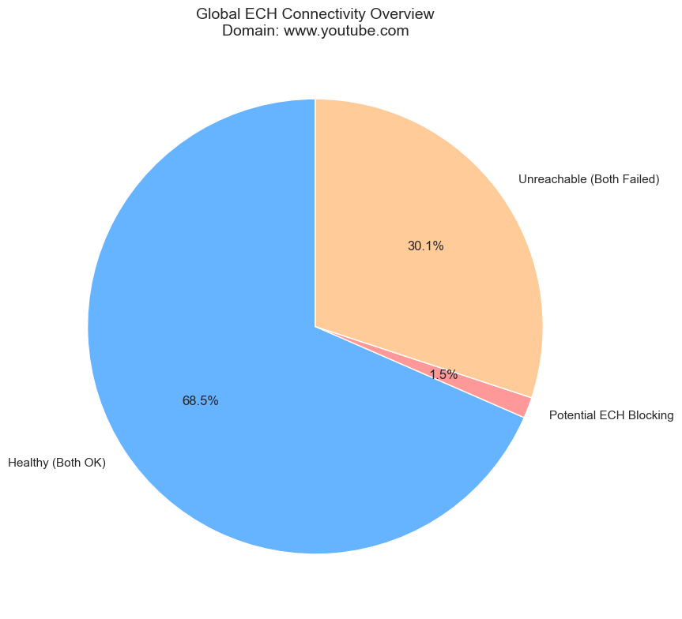
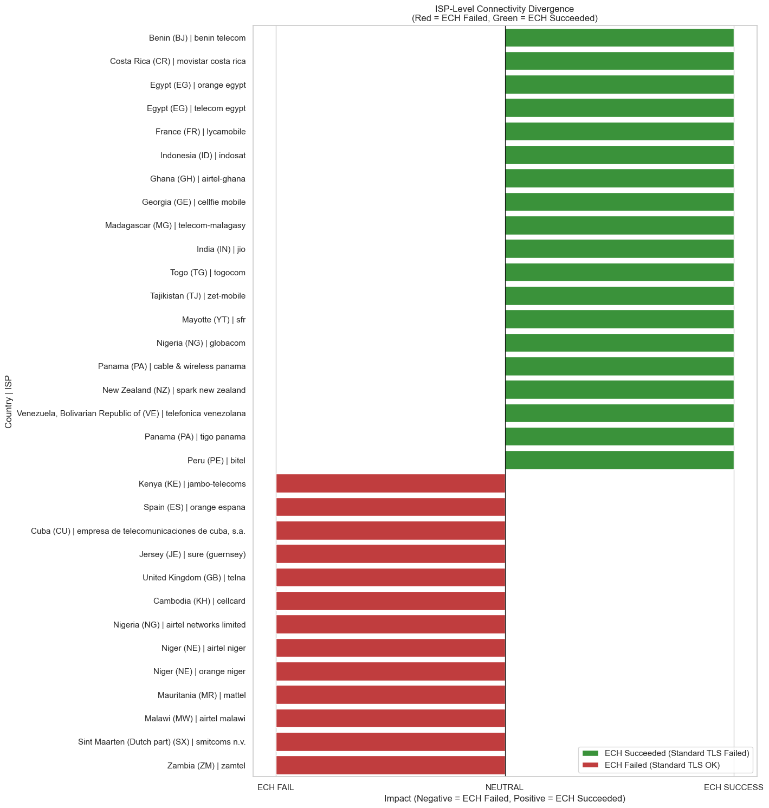
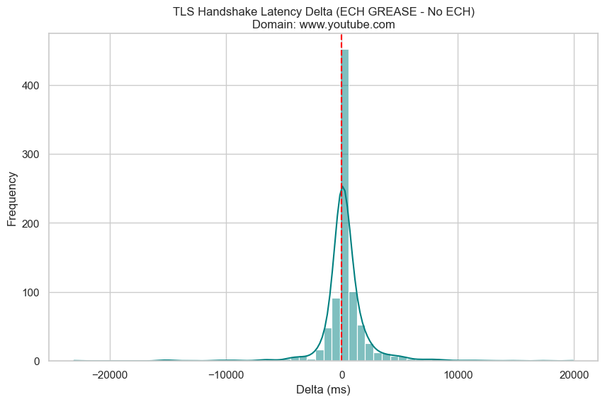

# Raw Report: ECH GREASE Connectivity (From Different Countries)

**Date:** February 04, 2026\
**Target Domain:** `www.youtube.com`\
**Analyzed File:** `soax-results-www_youtube_com-countries249.csv`

## Executive Summary

This report analyzed **878** valid ISP pairs. ECH GREASE shows **minor** regional connectivity issues.

*   **Total ISP Pairs:** 878
*   **Potential Blocking:** 13 (1.48%)
*   **Avg Latency Impact:** 274.20 ms

## 1. Overall Connectivity Results

**Figure 1: Global Connectivity Distribution.** This chart illustrates the health of tested ISP vantage points. "Healthy" represents successful connections with and without ECH. "Potential ECH Blocking" identifies cases where only the standard TLS succeeded. "Unreachable" indicates ISPs that failed both tests, likely due to proxy or local network issues unrelated to ECH.

## 2. Divergent ISP Connectivity (Deep Dive)

**Figure 2: ISP-Level Connectivity Divergence.** This chart highlights ISPs where the connectivity outcome of ECH GREASE differs from standard TLS. **Red bars (Left)** indicate **ECH Failed** (Standard TLS worked, but ECH failed). **Green bars (Right)** indicate **ECH Succeeded** (Standard TLS failed, but ECH succeeded), showing cases where ECH maintained connectivity despite standard TLS issues.

## 3. Performance Impact

**Figure 3: Latency Delta Distribution.** The delta is calculated as `Handshake(GREASE) - Handshake(No ECH)`. Most values clustering around 0ms suggest that ECH GREASE does not introduce significant overhead when connections succeed.

## 4. Deep Dive: Potential Blocking

We detected **13** instances where ECH GREASE failed while the control succeeded. These cases warrant further investigation to distinguish between transient network errors and active blocking.

**Affected Countries:**
*   Niger (NE): 2 instance(s)
*   Cuba (CU): 1 instance(s)
*   Spain (ES): 1 instance(s)
*   United Kingdom (GB): 1 instance(s)
*   Jersey (JE): 1 instance(s)
*   Kenya (KE): 1 instance(s)
*   Cambodia (KH): 1 instance(s)
*   Mauritania (MR): 1 instance(s)
*   Malawi (MW): 1 instance(s)
*   Nigeria (NG): 1 instance(s)
*   Sint Maarten (Dutch part) (SX): 1 instance(s)
*   Zambia (ZM): 1 instance(s)

(See Appendix A for the full list of failures)

## 5. Limitations

*   **Transient Errors:** Single-pass testing cannot distinguish between flaky networks and deterministic blocking. Re-runs are required for confirmation.
*   **Proxy Stability:** Residential proxies (SOAX) can be inherently unstable or slow, which may contribute to timeouts independent of ECH.
*   **Sample Size:** The number of ISPs tested per country depends on SOAX's available pool at the time of testing.

## Appendix A: Detailed Failure List

| Country | ISP | No ECH Exit | GREASE Exit | Error Name |
| :--- | :--- | :--- | :--- | :--- |
| Cuba (CU) | empresa de telecomunicaciones de cuba, s.a. | 0 | 28 | CURLE_OPERATION_TIMEDOUT |
| Spain (ES) | orange espana | 0 | 56 | CURLE_RECV_ERROR |
| United Kingdom (GB) | telna | 0 | 28 | CURLE_OPERATION_TIMEDOUT |
| Jersey (JE) | sure (guernsey) | 0 | 28 | CURLE_OPERATION_TIMEDOUT |
| Kenya (KE) | jambo-telecoms | 0 | 28 | CURLE_OPERATION_TIMEDOUT |
| Cambodia (KH) | cellcard | 0 | 56 | CURLE_RECV_ERROR |
| Mauritania (MR) | mattel | 0 | 56 | CURLE_RECV_ERROR |
| Malawi (MW) | airtel malawi | 0 | 28 | CURLE_OPERATION_TIMEDOUT |
| Niger (NE) | airtel niger | 0 | 28 | CURLE_OPERATION_TIMEDOUT |
| Niger (NE) | orange niger | 0 | 28 | CURLE_OPERATION_TIMEDOUT |
| Nigeria (NG) | airtel networks limited | 0 | 28 | CURLE_OPERATION_TIMEDOUT |
| Sint Maarten (Dutch part) (SX) | smitcoms n.v. | 0 | 56 | CURLE_RECV_ERROR |
| Zambia (ZM) | zamtel | 0 | 56 | CURLE_RECV_ERROR |

## Appendix B: Significant Latency Increases (>500ms)

| Country | ISP | No ECH TLS (ms) | GREASE TLS (ms) | Delta (ms) |
| :--- | :--- | :--- | :--- | :--- |
| Uganda (UG) | airtel uganda | 4036 | 23958 | 19922 |
| Gambia (GM) | qcell | 0 | 17212 | 17212 |
| Sint Maarten (Dutch part) (SX) | smitcoms n.v. | 1883 | 16482 | 14599 |
| Hong Kong (HK) | hutchison hk | 988 | 13699 | 12711 |
| Nigeria (NG) | airtel networks limited | 1735 | 13171 | 11436 |
| Venezuela, Bolivarian Republic of (VE) | corporacion digitel | 5783 | 16577 | 10794 |
| Sierra Leone (SL) | zain | 2533 | 12209 | 9676 |
| Jersey (JE) | sure (guernsey) | 1517 | 10319 | 8802 |
| Korea, Republic of (KR) | sk telecom | 1428 | 9766 | 8338 |
| Spain (ES) | digi spain | 1650 | 9708 | 8058 |
| Pakistan (PK) | hazara communication | 1374 | 9298 | 7924 |
| South Africa (ZA) | mtn sa | 1579 | 9346 | 7767 |
| Romania (RO) | orange romania | 714 | 7856 | 7142 |
| Libya (LY) | al-madar-al-jadeed | 618 | 7583 | 6965 |
| India (IN) | airtel | 6941 | 13868 | 6927 |
| Kenya (KE) | airtel kenya | 2191 | 8497 | 6306 |
| Mali (ML) | sotelmabgp | 2226 | 8132 | 5906 |
| Gambia (GM) | gamtel | 2813 | 8589 | 5776 |
| Somalia (SO) | somtel | 6955 | 12437 | 5482 |
| India (IN) | jio | 0 | 5482 | 5482 |
| Cyprus (CY) | cablenet communication systems | 810 | 6076 | 5266 |
| Senegal (SN) | sudatel-senegal | 13111 | 18270 | 5159 |
| Armenia (AM) | ucom | 1473 | 6622 | 5149 |
| Italy (IT) | plintron europe limited | 1478 | 6455 | 4977 |
| Solomon Islands (SB) | bemobile solomon islands | 1560 | 6486 | 4926 |
| Indonesia (ID) | smartfren | 919 | 5790 | 4871 |
| Kuwait (KW) | ooredoo kuwait | 989 | 5819 | 4830 |
| Israel (IL) | pelephone | 1334 | 6119 | 4785 |
| Canada (CA) | shaw communications | 467 | 5229 | 4762 |
| Afghanistan (AF) | afghan telecom | 1988 | 6492 | 4504 |
| Saudi Arabia (SA) | zain kuwait | 1239 | 5733 | 4494 |
| Kiribati (KI) | amalgamated telecom holdings kiribati | 2006 | 6370 | 4364 |
| Zimbabwe (ZW) | netone-cellular | 1370 | 5497 | 4127 |
| Egypt (EG) | vodafone egypt | 700 | 4823 | 4123 |
| Kenya (KE) | telkom | 2349 | 6347 | 3998 |
| Singapore (SG) | singtel mobile | 1406 | 5321 | 3915 |
| Pakistan (PK) | special communication organization | 1272 | 5133 | 3861 |
| United Kingdom (GB) | sure south atlantic | 2183 | 6015 | 3832 |
| Spain (ES) | yoigo | 894 | 4717 | 3823 |
| South Africa (ZA) | telkom limited | 1159 | 4894 | 3735 |
| Niger (NE) | orange niger | 2892 | 6477 | 3585 |
| Spain (ES) | zinnia telecomunicaciones sl. | 1378 | 4883 | 3505 |
| Bangladesh (BD) | grameenphone | 1048 | 4494 | 3446 |
| Russian Federation (RU) | tele2 russia | 3319 | 6696 | 3377 |
| Timor-Leste (TL) | viettel timor leste | 12156 | 15476 | 3320 |
| Myanmar (MM) | atom myanmar | 1618 | 4814 | 3196 |
| Bahrain (BH) | zain bahrain b.s.c. | 929 | 4124 | 3195 |
| Martinique (MQ) | outremer telecom | 1747 | 4938 | 3191 |
| Guam (GU) | lumen | 1356 | 4482 | 3126 |
| Zambia (ZM) | airtel zambia | 1330 | 4422 | 3092 |
| Serbia (RS) | telenor d.o.o. | 702 | 3778 | 3076 |
| France (FR) | orange | 926 | 4000 | 3074 |
| Cyprus (CY) | epic | 809 | 3623 | 2814 |
| Dominican Republic (DO) | visnetwork srl | 361 | 3166 | 2805 |
| Japan (JP) | japan communication | 2213 | 4951 | 2738 |
| Bangladesh (BD) | telenor | 950 | 3643 | 2693 |
| Cambodia (KH) | smart axiata | 2586 | 5273 | 2687 |
| Samoa (WS) | vodafone samoa | 1924 | 4591 | 2667 |
| Uruguay (UY) | claro uruguay | 2896 | 5436 | 2540 |
| Poland (PL) | plus poland | 950 | 3438 | 2488 |
| Zambia (ZM) | beeline-telecoms-limited | 1681 | 4120 | 2439 |
| Cameroon (CM) | mtn cameroon | 2296 | 4723 | 2427 |
| Tanzania, United Republic of (TZ) | vodacom tanzania | 1720 | 4076 | 2356 |
| Mozambique (MZ) | vodacom mozambique | 1126 | 3464 | 2338 |
| Trinidad and Tobago (TT) | digicel trinidad & tobago | 1786 | 4100 | 2314 |
| Australia (AU) | optus | 1692 | 3989 | 2297 |
| Iraq (IQ) | comm1 | 1378 | 3637 | 2259 |
| Serbia (RS) | a1 srbija d.o.o | 598 | 2820 | 2222 |
| Peru (PE) | entel peru | 637 | 2829 | 2192 |
| Israel (IL) | telzar 019 international telecommunications servic | 468 | 2651 | 2183 |
| Congo (CG) | mtn congo | 1164 | 3346 | 2182 |
| Germany (DE) | vodafone germany | 513 | 2652 | 2139 |
| Côte d'Ivoire (CI) | mtn cote divoire | 982 | 3105 | 2123 |
| Spain (ES) | vodafone spain | 597 | 2701 | 2104 |
| Malaysia (MY) | ytl communications sdn bhd | 955 | 3056 | 2101 |
| Lesotho (LS) | econet telecom lesotho | 1403 | 3494 | 2091 |
| Guinea-Bissau (GW) | mtn-bissau | 1377 | 3467 | 2090 |
| Iraq (IQ) | asiacell communications pjsc | 2143 | 4180 | 2037 |
| Ecuador (EC) | conecel | 580 | 2607 | 2027 |
| Afghanistan (AF) | afghan wireless communication company | 1573 | 3592 | 2019 |
| France (FR) | sfr | 548 | 2566 | 2018 |
| United Kingdom (GB) | three | 895 | 2906 | 2011 |
| Iraq (IQ) | seven net | 1303 | 3301 | 1998 |
| Sri Lanka (LK) | mobitel | 924 | 2914 | 1990 |
| Sweden (SE) | tele2 sweden | 405 | 2395 | 1990 |
| Brazil (BR) | vivo | 524 | 2477 | 1953 |
| Slovakia (SK) | swan, a.s. | 2784 | 4694 | 1910 |
| Bolivia, Plurinational State of (BO) | nuevatel pcs de bolivia s.a. | 2870 | 4774 | 1904 |
| Philippines (PH) | smart communications | 944 | 2797 | 1853 |
| Saint Lucia (LC) | flow | 1876 | 3699 | 1823 |
| Togo (TG) | atlantique telecom | 4358 | 6174 | 1816 |
| Kenya (KE) | jambo-telecoms | 1875 | 3691 | 1816 |
| Mexico (MX) | mexico red de telecomunicaciones, s. de r.l. de c. | 2808 | 4616 | 1808 |
| Cuba (CU) | empresa de telecomunicaciones de cuba, s.a. | 724 | 2526 | 1802 |
| Nigeria (NG) | spectranet | 1971 | 3769 | 1798 |
| Spain (ES) | open cable telecomunicaciones, s.l. | 5054 | 6851 | 1797 |
| Congo (CG) | airtel congo | 1491 | 3248 | 1757 |
| Lao People's Democratic Republic (LA) | lao telecom communication, ltc | 1044 | 2799 | 1755 |
| Canada (CA) | bell mobility | 1217 | 2970 | 1753 |
| Taiwan, Province of China (TW) | asia pacific telecom | 962 | 2686 | 1724 |
| Cyprus (CY) | kktcell | 894 | 2608 | 1714 |
| Mayotte (YT) | free reunion | 1693 | 3384 | 1691 |
| Namibia (NA) | mtc namibia | 1868 | 3557 | 1689 |
| Central African Republic (CF) | orange central african republic | 3037 | 4683 | 1646 |
| Haiti (HT) | alpha communications network | 1195 | 2825 | 1630 |
| Hong Kong (HK) | csl mobile | 1085 | 2711 | 1626 |
| Australia (AU) | telstra internet | 1458 | 3071 | 1613 |
| Jamaica (JM) | cable and wireless jamaica | 1652 | 3242 | 1590 |
| Cameroon (CM) | camtel | 1212 | 2774 | 1562 |
| Papua New Guinea (PG) | vodafone png | 1683 | 3230 | 1547 |
| Chile (CL) | entel hogar fibra | 629 | 2162 | 1533 |
| Poland (PL) | t-mobile polska | 868 | 2384 | 1516 |
| Japan (JP) | rakuten mobile network | 1174 | 2671 | 1497 |
| Senegal (SN) | sonatel | 771 | 2264 | 1493 |
| Japan (JP) | ntt docomo | 1084 | 2564 | 1480 |
| Bulgaria (BG) | vivacom | 675 | 2152 | 1477 |
| Austria (AT) | magenta telekom | 780 | 2256 | 1476 |
| United Kingdom (GB) | telna | 1759 | 3235 | 1476 |
| Peru (PE) | fibra movistar | 8116 | 9583 | 1467 |
| Suriname (SR) | digicel suriname nv | 850 | 2310 | 1460 |
| Malawi (MW) | airtel malawi | 1669 | 3127 | 1458 |
| Zimbabwe (ZW) | telone | 1420 | 2876 | 1456 |
| Poland (PL) | foxnet isp sp. z o.o. | 855 | 2299 | 1444 |
| Nigeria (NG) | mtn nigeria | 1317 | 2761 | 1444 |
| United States (US) | optimum | 364 | 1800 | 1436 |
| Afghanistan (AF) | mtn afghanistan | 1475 | 2881 | 1406 |
| Bangladesh (BD) | banglalink digital communications ltd. | 972 | 2372 | 1400 |
| Armenia (AM) | telecom armenia ojsc | 559 | 1958 | 1399 |
| Mali (ML) | mali-atel | 1919 | 3311 | 1392 |
| Italy (IT) | digi italy | 1824 | 3185 | 1361 |
| Turks and Caicos Islands (TC) | digicel turks and caicos | 299 | 1657 | 1358 |
| South Sudan (SS) | telecom-4g | 1553 | 2892 | 1339 |
| Togo (TG) | togocom | 1947 | 3282 | 1335 |
| Djibouti (DJ) | djibouti telecom | 955 | 2282 | 1327 |
| Singapore (SG) | starhub | 711 | 1998 | 1287 |
| Guadeloupe (GP) | digicel antilles francaises guyane | 703 | 1974 | 1271 |
| France (FR) | arelion sweden ab | 524 | 1760 | 1236 |
| Madagascar (MG) | gulfsat-madagascar | 1832 | 3057 | 1225 |
| Brazil (BR) | claro brazil | 827 | 2041 | 1214 |
| Uganda (UG) | tangerine-ug | 1167 | 2380 | 1213 |
| Japan (JP) | k-opticom corporation | 1684 | 2883 | 1199 |
| Chile (CL) | movistar chile | 528 | 1709 | 1181 |
| Viet Nam (VN) | viettel group | 1304 | 2479 | 1175 |
| Fiji (FJ) | digicel fiji | 1814 | 2951 | 1137 |
| Jordan (JO) | jordan telecommunications psc | 1065 | 2200 | 1135 |
| Lao People's Democratic Republic (LA) | star telecom | 1025 | 2155 | 1130 |
| Portugal (PT) | nos comunicacoes | 1107 | 2224 | 1117 |
| New Caledonia (NC) | opt-nc | 1883 | 2999 | 1116 |
| United Arab Emirates (AE) | du | 1244 | 2356 | 1112 |
| Hong Kong (HK) | china mobile hong kong | 956 | 2067 | 1111 |
| Denmark (DK) | telia | 893 | 1986 | 1093 |
| Maldives (MV) | ooredoo maldives | 1458 | 2541 | 1083 |
| Kyrgyzstan (KG) | nur telecom | 960 | 2039 | 1079 |
| Vanuatu (VU) | digicel vanuatu | 1581 | 2654 | 1073 |
| Japan (JP) | ntt communications corporation | 1013 | 2074 | 1061 |
| Malaysia (MY) | tm net | 1731 | 2783 | 1052 |
| Sao Tome and Principe (ST) | cst-net | 1293 | 2305 | 1012 |
| Taiwan, Province of China (TW) | fareastone | 978 | 1989 | 1011 |
| Colombia (CO) | tigo colombia | 689 | 1699 | 1010 |
| Japan (JP) | softbank corp. | 988 | 1997 | 1009 |
| Madagascar (MG) | orange madagascar | 1563 | 2571 | 1008 |
| Thailand (TH) | 3bb broadband | 892 | 1899 | 1007 |
| Bosnia and Herzegovina (BA) | jp ht d.d. mostar | 763 | 1764 | 1001 |
| Saudi Arabia (SA) | zain saudi arabia | 829 | 1827 | 998 |
| Portugal (PT) | lycamobile | 1045 | 2033 | 988 |
| Pakistan (PK) | jazz | 1419 | 2402 | 983 |
| Liberia (LR) | lonestar | 2040 | 3014 | 974 |
| Tanzania, United Republic of (TZ) | airtel tanzania | 1307 | 2264 | 957 |
| United Arab Emirates (AE) | du telecom | 1076 | 2022 | 946 |
| Burkina Faso (BF) | orange burkina faso | 1153 | 2098 | 945 |
| Cambodia (KH) | flash broadband pvt. ltd. | 837 | 1767 | 930 |
| Finland (FI) | elisa | 640 | 1557 | 917 |
| Tajikistan (TJ) | llc babilon-t | 1397 | 2288 | 891 |
| Czech Republic (CZ) | o2 czech republic | 660 | 1538 | 878 |
| Senegal (SN) | tigo senegal | 1618 | 2493 | 875 |
| Peru (PE) | claro peru | 969 | 1839 | 870 |
| Kenya (KE) | safaricom | 1004 | 1871 | 867 |
| Pakistan (PK) | ptcl | 1459 | 2325 | 866 |
| Myanmar (MM) | mytel | 1129 | 1991 | 862 |
| Oman (OM) | vodafone oman | 1214 | 2071 | 857 |
| Estonia (EE) | elisa eesti | 800 | 1643 | 843 |
| Congo, the Democratic Republic of the (CD) | africell-drc | 1633 | 2470 | 837 |
| Israel (IL) | hot mobile | 834 | 1670 | 836 |
| Kazakhstan (KZ) | tns-plus llp | 878 | 1712 | 834 |
| United States (US) | pavlov media | 498 | 1329 | 831 |
| Tonga (TO) | tonga communications internet network | 2034 | 2858 | 824 |
| Seychelles (SC) | cable & wireless (seychelles) | 1106 | 1928 | 822 |
| Tanzania, United Republic of (TZ) | ttcldata | 1082 | 1899 | 817 |
| Saudi Arabia (SA) | etihad salam telecom cjsc | 1185 | 1993 | 808 |
| Congo, the Democratic Republic of the (CD) | airtel drc | 1133 | 1937 | 804 |
| Paraguay (PY) | claro paraguay | 832 | 1631 | 799 |
| South Africa (ZA) | mtn business solutions | 1641 | 2420 | 779 |
| Poland (PL) | orange mobile | 581 | 1358 | 777 |
| Somalia (SO) | hormuud | 1178 | 1954 | 776 |
| Tajikistan (TJ) | cjsc babilon-mobile | 920 | 1693 | 773 |
| Pakistan (PK) | zong | 1466 | 2236 | 770 |
| Brazil (BR) | tim brasil | 1194 | 1959 | 765 |
| Malawi (MW) | tnm | 1872 | 2622 | 750 |
| Chad (TD) | airtel chad | 1190 | 1938 | 748 |
| United Kingdom (GB) | vodafone | 698 | 1439 | 741 |
| Israel (IL) | cellcom | 1112 | 1833 | 721 |
| Bosnia and Herzegovina (BA) | mtel bosnia | 1593 | 2313 | 720 |
| Croatia (HR) | hrvatski telekom | 549 | 1266 | 717 |
| Poland (PL) | comasoft | 861 | 1573 | 712 |
| Ghana (GH) | mtn ghana | 1224 | 1935 | 711 |
| Israel (IL) | hotnet | 764 | 1459 | 695 |
| Montenegro (ME) | crnogorski telekom a.d.podgorica | 563 | 1255 | 692 |
| Nepal (NP) | nepal telecom | 999 | 1688 | 689 |
| Argentina (AR) | claro argentina | 1028 | 1715 | 687 |
| Montenegro (ME) | drustvo za telekomunikacije mtel doo | 870 | 1557 | 687 |
| Turkey (TR) | vodafone turkey | 551 | 1236 | 685 |
| Albania (AL) | one albania | 569 | 1252 | 683 |
| Iceland (IS) | vodafone iceland | 639 | 1314 | 675 |
| Macedonia, the Former Yugoslav Republic of (MK) | a1 makedonija | 499 | 1173 | 674 |
| Tonga (TO) | digicel tonga | 1567 | 2235 | 668 |
| Hungary (HU) | one hungary | 541 | 1201 | 660 |
| Tajikistan (TJ) | closed joint stock company tt mobile | 1912 | 2559 | 647 |
| Azerbaijan (AZ) | azercell telecom | 652 | 1296 | 644 |
| Chile (CL) | wom chile | 707 | 1351 | 644 |
| Belarus (BY) | mts belarus | 972 | 1608 | 636 |
| Germany (DE) | o2 deutschland | 2006 | 2639 | 633 |
| Réunion (RE) | sfr | 1374 | 2003 | 629 |
| Greece (GR) | nova greece | 0 | 628 | 628 |
| Estonia (EE) | tele2 estonia | 491 | 1115 | 624 |
| Japan (JP) | internet initiative japan | 1250 | 1871 | 621 |
| Costa Rica (CR) | grupo ice | 876 | 1496 | 620 |
| Latvia (LV) | latvijas mobilais telefons sia | 449 | 1064 | 615 |
| Somalia (SO) | telesom | 1254 | 1862 | 608 |
| Uzbekistan (UZ) | universal mobile systems lcc | 947 | 1555 | 608 |
| United States (US) | c spire | 538 | 1142 | 604 |
| Syrian Arab Republic (SY) | syriatel mobile telecom | 698 | 1300 | 602 |
| Colombia (CO) | claro colombia | 1971 | 2562 | 591 |
| Lithuania (LT) | telia lietuva | 775 | 1364 | 589 |
| Tunisia (TN) | orange internet | 1371 | 1959 | 588 |
| Pakistan (PK) | telenor pakistan | 1874 | 2455 | 581 |
| Cyprus (CY) | kktc telsim | 730 | 1303 | 573 |
| Ireland (IE) | three ireland | 688 | 1260 | 572 |
| Luxembourg (LU) | proximus luxembourg | 663 | 1234 | 571 |
| Japan (JP) | au one net | 837 | 1407 | 570 |
| Azerbaijan (AZ) | bakcell | 857 | 1418 | 561 |
| Sri Lanka (LK) | dialog axiata | 934 | 1493 | 559 |
| Poland (PL) | alkom sp. z o.o. | 563 | 1103 | 540 |
| Zimbabwe (ZW) | tagtel-communications | 1313 | 1848 | 535 |
| Bahrain (BH) | stc bahrain | 781 | 1314 | 533 |
| Singapore (SG) | simba telecom | 794 | 1319 | 525 |
| Italy (IT) | vodafone italia | 485 | 1005 | 520 |
| Chile (CL) | mundo chile | 866 | 1385 | 519 |
| Finland (FI) | elisa mobile | 594 | 1109 | 515 |
| Kenya (KE) | faiba | 1565 | 2073 | 508 |
| Spain (ES) | digi spain telecom | 619 | 1124 | 505 |

